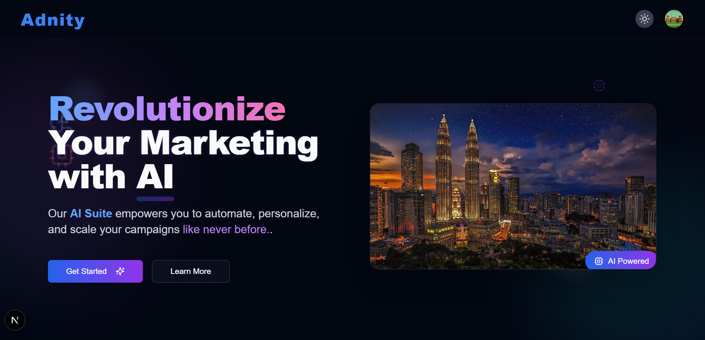

<div align="center" id='readme-top'>
  
  <h1 align="center">🌿 Adnity - AI Marketing Platform</h1>

  <p align="center">
   A modern AI-powered marketing platform with beautiful UI, animations, and full light/dark mode support.
    <br />   
    <br />
    <a href="https://adnity.vercel.app">You can see the Demo Live</a>
  </p>
</div>

## Project Looks

 <!-- Add your banner image if available -->


## 🚀 Features

- **AI-Powered Marketing Tools**
- **Modern Glass Morphism UI**
- **Smooth Animations & Transitions**
- **Fully Responsive Design**
- **Light/Dark Mode Toggle**
- **Interactive Components**
  - Animated Testimonials Carousel
  - Collapsible FAQ Section
  - Pricing Cards with Feature Comparison
  - Floating Elements with Motion Effects

## 🛠 Technologies Used

### Frontend
- **Next.js** (App Router)
- **React** (Functional Components, Hooks)
- **Tailwind CSS** (Styling)
- **Framer Motion** (Animations)
- **Lucide React** (Icons)
- **Clerk** (Authentication)

### Backend (if applicable)
- **Node.js**
- **Express**
- **MongoDB** (or your database)
- **Prisma** (ORM)

## 📦 Installation

1. Clone the repository:
   ```bash
   git clone https://github.com/yourusername/adnity.git
   cd adnity